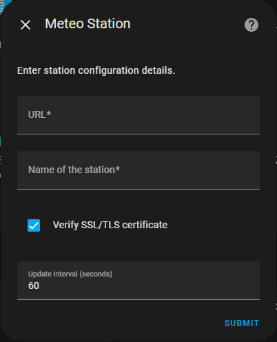

# Home Assistant Integration for Meteo Station

This is [Home Assistant](https://www.home-assistant.io/) integration for [my weather station](https://github.com/bartekl1/meteo).

[🇵🇱 Polskie README](README_PL.md)

## Installation

### Option 1: using HACS (Home Assistant Community Store)

> [!NOTE]
> This integration is not available in public HACS repository. You need to add it manually.

1. Install [HACS](https://www.hacs.xyz/docs/use/).
2. Add custom repository:

**Option 1**: Using My link \
Click on the following button, go to your Home Assistant instance and confirm the addition of the repository. \
[](https://my.home-assistant.io/redirect/hacs_repository/?owner=bartekl1&repository=meteo_ha&category=integration)

**Option 2**: Manually \
Go to HACS > three dots menu > Custom repositories, paste the following URL and select "Integration" as category.

```
https://github.com/bartekl1/meteo_ha
```

3. Go to HACS, search for "Meteo Station" and install the integration.
4. Restart Home Assistant. HACS should notify you about restart requirement, if not go to Settings > System > power menu and restart.

### Option 2: manual installation

1. Download `custom_components/bartekl1_meteo` directory from this repository and copy it to `/homeassistant/custom_components` directory on your Home Assistant instance. \
To do this, you can install [Terminal & SSH](https://my.home-assistant.io/redirect/supervisor_addon/?addon=core_ssh) add-on and copy files using SFTP.
2. Restart Home Assistant. Go to Settings > System > power menu and restart.

## Configuration

1. Go to Settings > Devices & Services > Integrations. Click on "Add Integration" button in the bottom right corner and search for "Meteo Station". \
You can also use following My link: \
[](https://my.home-assistant.io/redirect/config_flow_start/?domain=bartekl1_meteo)

2. Following window should appear: \


3. Enter URL and name of your station. You can also change update interval and disable SSL/TLS certificate verification.

4. Done! Station should be available in Home Assistant. You can find it in Settings > Devices & Services > Devices.
