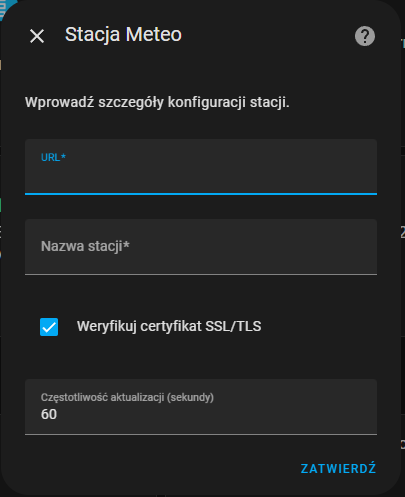

# Integracja Home Assistant dla Stacji Meteo

To jest integracja [Home Assistant](https://www.home-assistant.io/) do [mojej stacji pogodowej](https://github.com/bartekl1/meteo).

[🇬🇧 English README](README.md)

## Instalacja

### Metoda 1: używając HACS (Home Assistant Community Store)

> [!NOTE]
> Ta integracja nie jest dostępna w publicznym repozytorium HACS. Musisz dodać ją ręcznie.

1. Zainstaluj [HACS](https://www.hacs.xyz/docs/use/).
2. Dodaj niestandardowe repozytorium:

**Metoda 1**: Używając My linku \
Kliknij na poniższy przycisk, przejdź do swojej instancji Home Assistant i potwierdź dodanie repozytorium. \
[](https://my.home-assistant.io/redirect/hacs_repository/?owner=bartekl1&repository=meteo_ha&category=integration)

**Metoda 2**: Ręcznie \
Przejdź do HACS > menu trzech kropek > Niestandardowe repozytoria, wklej poniższy URL i wybierz "Integracja" jako typ.

```
https://github.com/bartekl1/meteo_ha
```

3. Przejdź do HACS, wyszukaj "Meteo Station" i zainstaluj integrację.
4. Zrestartuj Home Assistant. HACS powinien powiadomić Cię o konieczności restartu, jeśli nie, przejdź do Ustawienia > System > menu zasilania i zrestartuj.

### Metoda 2: ręczna instalacja

1. Pobierz katalog `custom_components/bartekl1_meteo` z tego repozytorium i skopiuj go do katalogu `/homeassistant/custom_components` na swojej instancji Home Assistant. \
Aby to zrobić, możesz zainstalować dodatek [Terminal & SSH](https://my.home-assistant.io/redirect/supervisor_addon/?addon=core_ssh) i skopiować pliki za pomocą SFTP.
2. Restartuj Home Assistant. Przejdź do Ustawienia > System > menu zasilania i zrestartuj.

## Konfiguracja

1. Przejdź do Ustawienia > Urządzenia i usługi > Integracje. Kliknij przycisk "Dodaj integrację" w prawym dolnym rogu i wyszukaj "Meteo Station". \
Możesz również użyć poniższego My linku: \
[](https://my.home-assistant.io/redirect/config_flow_start/?domain=bartekl1_meteo)

2. Powinno pojawić się następujące okno: \


3. Wprowadź URL i nazwę swojej stacji. Możesz również zmienić częstotliwość aktualizacji i wyłączyć weryfikację certyfikatu SSL/TLS.

4. Gotowe! Stacja powinna być dostępna w Home Assistant. Możesz ją znaleźć w Ustawienia > Urządzenia i usługi > Urządzenia.
